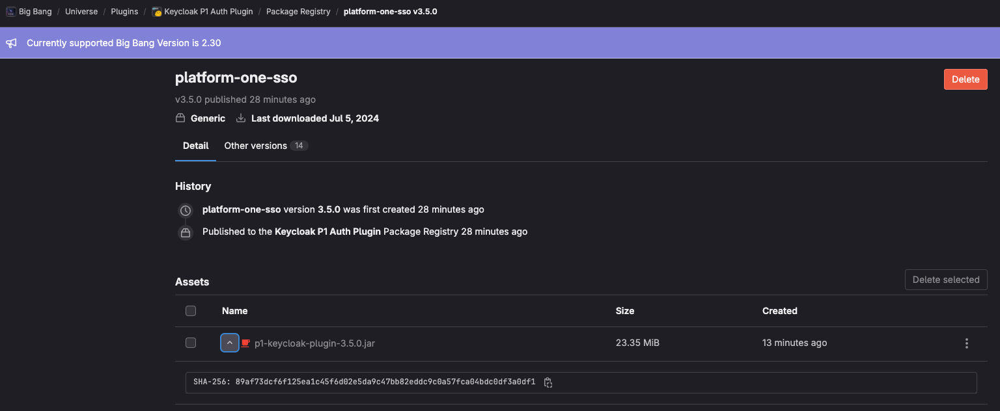

# P1 Plugin Compatibility Matrix
The Platform One custom provider plugin is now decoupled from the Big Bang Keycloak repo. Use this table in conjunction with the [CHANGELOG.md](../CHANGELOG.md) to choose the most appropriate plugin version to use for your deployment.

| **PLUGIN VERSION** | **KEYCLOAK VERSION** | **KEYCLOAK VERSION**<br>**COMPATIBILITY** |
|:-------------------|:---------------------|:------------------------------------------|
| 3.5.1              | 25.0.2               | 25.0.X                                    |
| 3.5.0              | 25.0.1               | 25.0.X                                    |
| 3.4.0              | 24.0.5               | 24.0.X                                    |
| 3.3.4              | 23.0.7               | 23.0.X                                    |
| 3.3.3              | 23.0.7               | 23.0.X                                    |
| 3.3.2              | 23.0.4               | 23.0.X                                    |
| 3.3.1              | 23.0.4               | 23.0.X                                    |
| 3.3.0              | 23.0.0               | 23.0.X                                    |
| 3.2.1              | 21.0.2               | 21.0.X                                    |
| 3.2.0              | 21.0.2               | 21.0.X                                    |
| 3.1.0              | 20.0.3               | 20.0.X                                    |
| 3.0.1              | 20.0.3               | 20.0.X                                    |
| 3.0.0              | 20.0.1               | 20.0.X                                    |

# How to update the Keycloak Plugin
This repo builds a custom Keycloak jar plugin file, which is eventually packaged in a [plugin image](https://ironbank.dso.mil/repomap/details;registry1Path=big-bang%252Fp1-keycloak-plugin). This repo is mirrored to [Party Bus IL2](https://code.il2.dso.mil/platform-one/big-bang/keycloak/keycloak-p1-auth-plugin) where a mission dev ops (MDO) pipeline is run with security scans. The mirrored branch on the code.il2.dso.mil side must be protected for pipelines to run (a maintainer or owner who can do this can be identified [here](https://code.il2.dso.mil/platform-one/big-bang/keycloak/keycloak-p1-auth-plugin/-/project_members)). The MDO pipeline creates a jar artifact that is hosted in [Gitlab](https://repo1.dso.mil/big-bang/product/plugins/keycloak-p1-auth-plugin/-/packages) and referenced in [Iron Bank](https://repo1.dso.mil/dsop/big-bang/p1-keycloak-plugin/-/blob/development/hardening_manifest.yaml). The plugin image can be pulled at `registry1.dso.mil/ironbank/big-bang/p1-keycloak-plugin:X.X.X`

1. Be aware that there are two distributions of Keycloak. One is the legacy version that uses Wildfly for the application server. The other version is the new one using Quarkus. This plugin supports the new Keycloak Quarkus. The new Keycloak images in Iron Bank have tag names without `legacy`.

1. Create a development branch and merge request from the Gitlab issue.

1. Recommended to use the free community version of Intellij IDEA instead of Visual Studio Code. Intellij IDEA has much better support for Java development. You can run unit tests with coverage and build from the IDE.

1. Update [CHANGELOG.md](../CHANGELOG.md) with an entry for "upgrade Keycloak plugin libraries to version x.x.x" or whatever description is appropriate.

1. Update the Keycloak library dependencies in the [p1-keycloak-plugin/build.gradle](../p1-keycloak-plugin/build.gradle) file to match the new version of Keycloak. This Keycloak library update might cause build errors. You might have to fix code in `src/main/**.java` and `src/test/**.java` to get the build and unit tests to complete without errors.

1. The plugin version is controlled by the top-level [gradle.properties](../gradle.properties). The built jar will be named with the semver from the `gradle.properties`. There is no hard rule for how to bump the semver X.X.X version. In general, if the update is a patch upgrade or a bug fix then bump the patch number. If the plugin is getting a major or minor version upgrade of the Keycloak libraries then bump the minor number. If there are significant changes to the plugin, new features, or repo restructuring then bump the major version number.

1. Update any of the other gradle plugins as needed.

1. Update the custom quarkus extension dependencies as needed in the [quarkus-ext-routing/deployment](../quarkus-ext-routing/deployment) project

1. Update the custom quarkus extension dependencies as needed in the [quarkus-ext-routing/runtime](../quarkus-ext-routing/runtime) project

1. Update any documentation as needed.

1. Run [code linting](#linting) and fix any findings.

1. Run [unit tests](#run-unit-tests), verify all unit tests pass, and fix any test errors. Verify that code coverage is greater than 80% overall using the Jacoco report.

1. Run the [Sonarqube scan](#sonarqube-scan) and fix all code scan findings. None are allowed in the Party Bus mission devops pipeline.

1. Run the [Sonarqube dependency check](#sonarqube-dependency-check) and study the results to identify any project dependencies that can be upgraded to remediate potential findings.

1. Follow instructions in the [Deployment Overview section](#deployment-overview) to build a plugin jar file and build it into an image.

1. Test plugin with Keycloak in the docker compose dev environment. See the [README.md](https://repo1.dso.mil/big-bang/product/packages/keycloak/-/blob/main/development/README.md) in Keycloak project for instructions.

1. Test plugin in Kubernetes by following the documentation in the [Keycloak package repo maintenance doc](https://repo1.dso.mil/big-bang/product/packages/keycloak/-/blob/main/docs/DEVELOPMENT_MAINTENANCE.md).

1. To test the Party Bus pipeline with your development branch cut a release candidate tag from the branch like this X.X.X-rc.X. You can verify that the new plugin code will pass before merging the MR. This will mirror to code.il2.dso.mil, run a [pipeline](https://code.il2.dso.mil/platform-one/big-bang/keycloak/keycloak-p1-auth-plugin/-/pipelines), and publish to the [package registry](https://repo1.dso.mil/big-bang/product/plugins/keycloak-p1-auth-plugin/-/packages). Download the jar published to the package registry and test via docker compose again to ensure nothing was missed. This will save time and unecessary iteration on the IB side, since it will reference the file published to the package registry.

1. Once testing has been satisfactorily completed, the plugin MR should be reviewed and merged to `main`. Make an official semver release tag in the p1 plugin repo and monitor the mirrored [Party Bus IL2 pipeline](https://code.il2.dso.mil/big-bang/keycloak/keycloak-p1-auth-plugin/-/pipelines) to make sure it passes. The artifact this tag pipeline produces will be referenced in the Iron Bank image.

1. After testing is completed (including the end-to-end SSO tests) publish the image in Iron Bank by following instructions in the [Publish plugin image to Iron Bank](#publish-plugin-image-to-iron-bank) section below.

# Deployment Overview
Jar files are deployed with Keycloak by placing them in `/opt/keycloak/providers/` directory. In a containerized k8s environment this happens by putting the jar in an plugin image and deploying the image as an additional init-container when Keycloak deploys. Keycloak k8s upstream has changed from Wildfly application server to [Quarkus](https://www.keycloak.org/migration/migrating-to-quarkus). This plugin supports the new Keycloak Quarkus.

This repo includes a custom Quarkus extension for routing and redirects. It is configurable with quarkus.properties. See the [development properties file](/quarkus-ext-routing/deployment/src/main/resources/application-quarkusdev.properties) for examples of how to configure. Also see [example k8s operational values](https://repo1.dso.mil/big-bang/bigbang/-/blob/master/docs/assets/configs/example/keycloak-prod-values.yaml).

## Deployment Details

### Build
First build this plugin project to create a jar file. This is a Java Gradle project. You can build it from an IDE or from command line. Here is how to build it from a docker container without installing dependencies on your workstation (note that this will usually be much slower than running locally and is more likely to fail). If you want to build on your workstation without the gradle image you will need to install the appropriate versions of JDK and gradle. On mac, recommend `sdkman` to easily manage multiple java versions. The java archive(jar) will be created at `/build/libs/p1-keycloak-plugin-x.x.x.jar`. The plugin uses semantic versioning controlled by the "version" in the top level `gradle.properties` configuration.
  
First, spin up a build container :
```bash
docker run -it --rm \
    --platform linux/amd64 \
    --entrypoint=bash \
    --user 0 \
    --volume $(pwd):/app \
    registry1.dso.mil/ironbank/opensource/gradle/gradle-jdk21:8.8
```
Then build the app :
```bash
cd /app
./gradlew clean build
```

### Build a plugin image
Build an image that contains the plugin jar. The official plugin image is hosted in [Iron Bank](https://ironbank.dso.mil/repomap/details;registry1Path=big-bang%252Fp1-keycloak-plugin) available to be pulled at `registry1.dso.mil/ironbank/big-bang/p1-keycloak-plugin:X.X.X`. Note that the Dockerfile matches the Dockerfile from the [Iron Bank dsop repository](https://repo1.dso.mil/dsop/big-bang/p1-keycloak-plugin/-/blob/development/Dockerfile). 

DO NOT configure production deployments using an image from the `bigbang-staging` registry1.dso.mil project. This project is for development testing only by the Big Bang Product team. _The below commands are for example only._

On Mac, recommend using Colima to build.
  
Build the image:
```bash
docker build --platform linux/amd64 -t registry1.dso.mil/bigbang-staging/keycloak-p1-auth-plugin/init-container:test-3.5.0 .
```
Verify the built image contains the plugin jar:
```bash
docker run -it --rm \
    registry1.dso.mil/bigbang-staging/keycloak-p1-auth-plugin/init-container:test-3.5.0 \
    sh -c "pwd && ls -lah | grep keycloak"
```
There it is:
```bash
/app
-rwxr-xr-x 1 root root  23M May  3 18:33 p1-keycloak-plugin-3.5.0.jar
```
Push the image to the staging registry:
```bash
docker push registry1.dso.mil/bigbang-staging/keycloak-p1-auth-plugin/init-container:test-3.5.0
```


## Local Quarkus Extension development environment
There is a custom Quarkus extension for routing packaged inside this repo.  

These maven commands can be used to launch a local development environment :
```bash
mvn clean install -f quarkus-ext-routing/runtime && \
mvn clean compile -f quarkus-ext-routing/deployment quarkus:dev \
    -Dquarkus.enforceBuildGoal=false \
    -Dquarkus.profile=quarkusdev
```

You may then test it in your browser at: [http://localhost:9005](http://localhost:9005)


If you see `Non-resolvable parent POM` errors then your local cache needs to be cleared with :
```bash
mvn clean install -N
```

# Publish plugin image to Iron Bank

After all testing (locally and k8s testing with a BigBang deployment) has been completed publish an official plugin image in [Iron Bank](https://repo1.dso.mil/dsop/big-bang/p1-keycloak-plugin). The updated image must be published to Iron Bank  

Brief instructions for IronBank pipeline maintenance:

1. The PartyBus IL2 MDO pipeline publishes the p1-keycloak-plugin-X.X.X.jar artifact back to the [P1 Keycloak Package Registry](https://repo1.dso.mil/big-bang/product/plugins/keycloak-p1-auth-plugin/-/packages)(for tag pipelines).

    ⚠️ At this point you should have merged the plugin changes to main, created a tag and the tag should have a passing pipeline in the mirrored [Party Bus pipeline](https://code.il2.dso.mil/platform-one/big-bang/keycloak/keycloak-p1-auth-plugin/-/pipelines). This will publish the jar to the package registry. If for reasons beyond our control an update needs to be pushed through and there are issues with the pipeline, the package can by published manually, *though this should be rare!* Maintainer or higher permissions are required to publish to the package registry.

    Fill in the variables in `<>`'s below as needed. `<token>` is your Gitlab PAT, `<tag/version>` is the plugin version e.g. `3.5.0`.

    ```
    curl --fail-with-body --header 'Authorization: Bearer <token>' --upload-file <full_path_to_plugin_jar_file> "https://repo1.dso.mil/api/v4/projects/12194/packages/generic/platform-one-sso/<tag/version>/p1-keycloak-plugin-<tag/version>.jar"
    ```

1. If you do not already have developer access to the [Iron Bank project](https://repo1.dso.mil/dsop/big-bang/p1-keycloak-plugin), you will need to [create a new issue](https://repo1.dso.mil/dsop/big-bang/p1-keycloak-plugin/-/issues/new) with template `Access Request`.
    - Example access request [issue](https://repo1.dso.mil/dsop/big-bang/p1-keycloak-plugin/-/issues/38).

1. In the Iron Bank repo, [create a new issue](https://repo1.dso.mil/dsop/big-bang/p1-keycloak-plugin/-/issues/new) with template `Application Update`.
    - Example [issue](https://repo1.dso.mil/dsop/big-bang/p1-keycloak-plugin/-/issues/40) and [MR](https://repo1.dso.mil/dsop/big-bang/p1-keycloak-plugin/-/merge_requests/38) from a recent update.

1. Create a branch and MR from the issue.

1. Update `hardening_manifest.yaml`
    - The tag version
    - The label org.opencontainers.image.version
    - resources.url
    - resources.validation.value (use sha256sum to get the hash value of the jar file)

    Url can be found from hovering over jar asset name, and sha is found my clicking on the down arrow to the left of the asset name.

    

1. Commit and push code changes

1. Verify that pipline passes

1. Complete checkbox items in the issue.
    - You can check if there are findings requiring justification in [VAT](https://vat.dso.mil/vat/image?imageName=big-bang/p1-keycloak-plugin&tag=3.4.0&branch=master). Select the correct plugin version to review findings and provide justifications as needed.

1. Mark the MR as ready and apply label `Status:Review` to the MR and the issue.

1. Monitor the issue to make sure it keeps moving with the Container Hardening Team(CHT). You can optionally post in the IL4 [BB <> IB MM channel](https://chat.il4.dso.mil/platform-one/channels/bb--ib) to help things move along more quickly.

1. Don't forget, the BigBang MR will need the `tests/test-values.yaml` updated to use the new plugin init-container tag.
    - registry1.dso.mil/ironbank/big-bang/p1-keycloak-plugin:X.X.X


## Other development tasks to pass MDO pipeline

### Linting
To run code linting locally :
```bash
docker run -it --rm -v $(pwd):/app registry1.dso.mil/ironbank/opensource/gradle/gradle-jdk21:8.8 bash
cd /app
./gradlew lintGradle
```

### Run unit tests
An IDE is best for running unit tests to get code coverage. You can also run unit tests from the CLI to generate an html report.
```bash
docker run -it --rm -v $(pwd):/app registry1.dso.mil/ironbank/opensource/gradle/gradle-jdk21:8.8 bash
cd /app
./gradlew clean test jacocoTestReport --info
```
Open the file `build/jacoco/html/index.html` in a browser to view the report that the pipeline uses. It typically shows less code coverage than the IDE.

## Sonarqube
### References :
https://www.sonarsource.com/open-source-editions/sonarqube-community-edition/

https://docs.sonarsource.com/sonarqube/latest/try-out-sonarqube/

https://docs.sonarsource.com/sonarqube/latest/analyzing-source-code/test-coverage/java-test-coverage/

To run a local sonarqube instance use this docker command :
```bash
docker run -d --name sonarqube -e SONAR_ES_BOOTSTRAP_CHECKS_DISABLE=true -p 9000:9000 sonarqube:latest
```
### How to Access local Sonarqube

Go to [localhost:9000](localhost:9000) with these credentials :
```bash
login: admin
password: admin
```
Sonarqube will ask you to change the password... just follow the steps.

Next click on `Create a local project` and in the fields use the [sonar-project-dev.properties](../sonar-project-dev.properties)

Once the project is created, click in `Locally` where you can generate the `Token` needed for the steps below.


### Sonarqube scan
 - Deploy Sonarqube and use the provided [sonar-project-dev.properties](../sonar-project-dev.properties). Follow the details in that sonar-scan config.  
- Manually create a `keycloak-plugin` sonar project in the UI which will generate a token.  
- You will need to do a clean build first because Sonarqube uses the built jar artifact.
```bash
./gradlew clean assemble
export SONAR_LOGIN=XXXXXXXXXXXXXXXXXXXXX
sonar-scanner -Dproject.settings=sonar-project-dev.properties
```

### Sonarqube Dependency Check
- Deploy Sonarqube using the provided [sonar-project-dependency-check-dev.properties](../sonar-project-dependency-check-dev.properties). Follow the details in that sonar-scan config.  
- Manually create a `keycloak-plugin-dependency-check` sonar project in the UI which generates a `token`.  
- You will need to do a clean build first because Sonarqube uses the built jar artifact.
```bash
./gradlew clean assemble
export SONAR_LOGIN_DEPENDENCY_CHECK=XXXXXXXXXXXXXXXXXXXXX
sonar-scanner -Dproject.settings=sonar-project-dependency-check-dev.properties
```